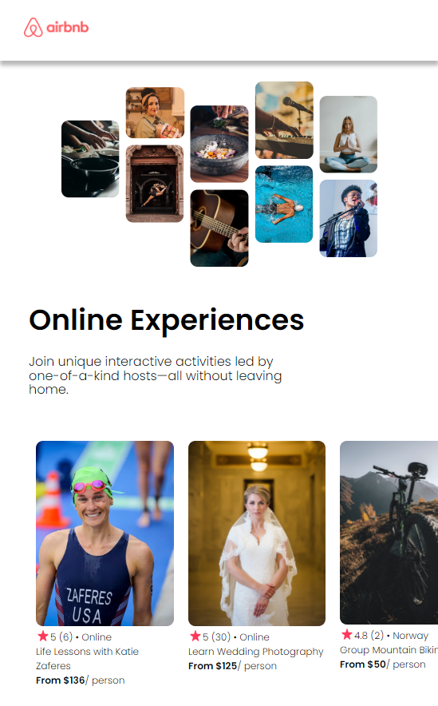

# React Business Card
Site uses [Vite](https://vitejs.dev/) dev tool.
 
Im learning react from [Scrimba](https://scrimba.com/learn/learnreact).
  
This is the on video project for the Scrimba. The goal of this project was to learn how to pass props and work from data.
  
I decided after following along with the video to build the project again on my own at the end. I started to try to structure my CSS files separately to try and reflect how a bigger project would look.
  
The goal here was to use react and CSS to recreate the template form [Figma](https://www.figma.com/file/4YjrygFEXOcDp9AAnVFv7o/Airbnb-Experiences).
 
# My airbnb site
 
Here is how mine turned out.
 

 
I will update and post a live version later.